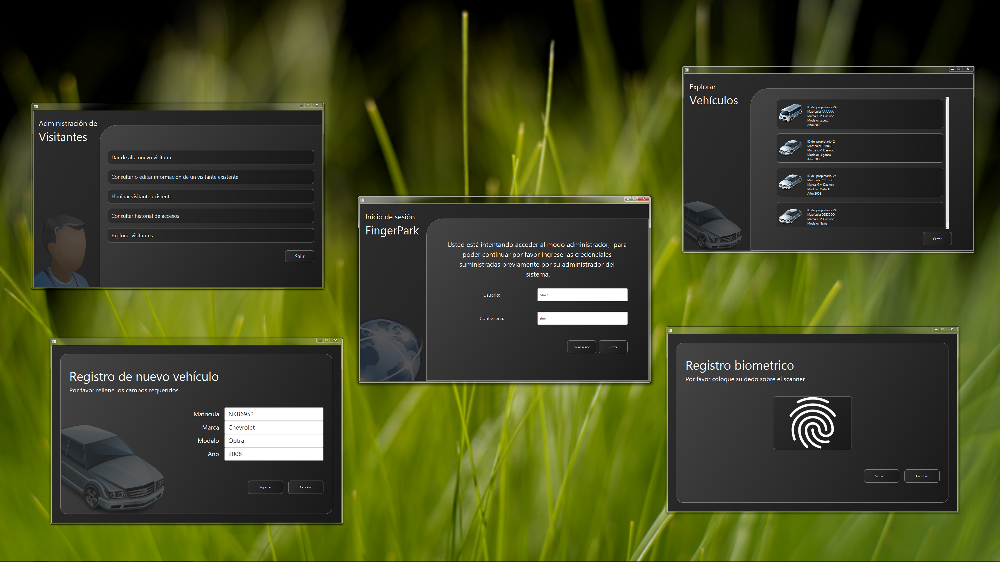

# Fingerpark

Fingerpark es un software de control de acceso y administración diseñado para recintos de estacionamiento que requieren una solución capaz de brindar servicio a diversos tipos de usuarios y autenticarlos mediante la biometría de huella dactilar.

 

## Características

- Interfaz de usuario elegante y moderna
- Elaboración de informes 
- Visualización de ganancias mediante gráficas
- Localización de propietarios
- Administración de vehículos
- Administración de visitantes pensionados

## Configuración

1.- Creación de una llave de seguridad RSA

El proyecto implementa autenticación a nivel de endpoint mediante tokens JWT, para lo cual es necesario proporcionar un par de llaves de seguridad RSA. El repositorio incluye un par de llaves de ejemplo extraídas de la documentación de Quarkus, sin embargo, se recomienda reemplazarlas por motivos de seguridad.

```
openssl genrsa -out keypair.pem 2048
openssl rsa -in keypair.pem -pubout -out public.pem
openssl pkcs8 -topk8 -inform PEM -outform PEM -nocrypt -in keypair.pem -out private.pem
rm keypair.pem
mv public.pem private.pem Server/src/main/resources
```

2. Inicialización de la base de datos

El proyecto hace uso exclusivo de Panache ORM y consultas JPQL para la serialización de entidades en una base de datos por lo que puede ser emparejado con cualquier sistema gestor de bases de datos relacionales. Se deben configurar los siguientes parámetros en el archivo application.properties, la base de datos puede estar desplegada localmente o en la nube.

```
quarkus.datasource.db-kind = postgresql
quarkus.datasource.username = postgres
quarkus.datasource.jdbc.url = jdbc:postgresql://localhost:5432/fingerpark
quarkus.hibernate-orm.schema-management.strategy=drop-and-create
```

3. Levantamiento del servidor

El servidor debe estar a la escucha de nuevas peticiones para que el Panel de Control y el Kiosko puedan funcionar con normalidad, de otra forma lanzaran mensajes de error al iniciar.

```
cd Server
mvn quarkus:dev
```
